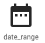
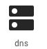
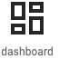
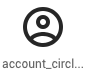
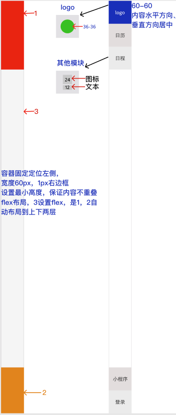
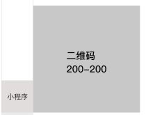

# 菜单栏模块设计

## 1. 模块规划

菜单栏包含模块:

+ 日历
+ 项目(列表)
+ 小程序二维码
+ 登录
+ 切换账号

## 2. 图标

| 图标           | 预览                           |
| -------------- | ------------------------------ |
| date_range     |      |
| dns            |             |
| repeat         |          |
| dashboard      |       |
| account_circle |  |

## 3. 布局及样式设计

菜单栏宽度60px, 高度是屏幕的高度, 固定到屏幕左侧, 添加右边框


## 4. 交互态

hover 改变元素的透明度为 .7

激活样式动态绑定class primary 和 white--text

## 5. 展开态



## 6. 动作触发交互

+ 点击 日历 按钮，切换主页的 第一列 的显示隐藏
+ 点击日程按钮，切换 项目列表  的显示隐藏
+ 鼠标移入小程序， 显示小程序二维码（后期APP，网站等二维码采用同样的方式展示）
+ 点击登录， 跳转登录界面， 如果已经登录，原登录框显示 切换账号 按钮，点击切换账号，同样跳转登录界面
+ 点击logo，跳转官网

## 7. 使用组件

+ v-avatar logo使用

``` html
<v-avatar color="grey lighten-4" size="36">
  
</v-avatar>
```

+ v-icon   图标使用 `<v-icon>图标名称</v-icon>`
