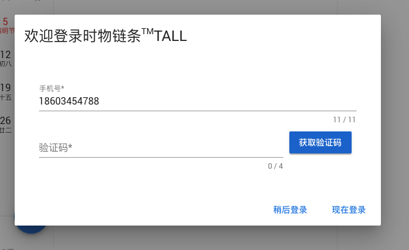

# 登录模块

## 手机号验证码登录

登录方式1：采用手机号、验证码登录（使用手机号、验证码登录，可以减少注册步骤）

手机号11位数字，验证码4位数字，有验证提示

手机号未正确填写， <button>获取验证码</button>按钮 处于disable状态，不能发送验证码请求

点击 <button>获取验证码</button> 倒计时120秒，期间按钮处于disable状态，不能再次发送验证码请求

点击 <button>现在登录</button> 按钮，在页面的右上方会出现 snackbar 轻提示，成功 显示 success样式，失败显示 error 样式，参考v-snackbar组件文档



## 账号密码登录

登录方式2：采用账号、密码登录（注： 账号是系统为用户分配的特定账号）

账号、密码必填，有验证提示

点击 <button>现在登录</button> 按钮，在页面的右上方会出现 snackbar 轻提示，成功 显示 success样式，失败显示 error 样式，参考v-snackbar组件文档

## 第三方登录

第三方登录可以使用微信、微博、qq、钉钉账号等进行登录

详细设计待定...

## 核心组件

+ v-layout 布局组件
+ v-card 卡片组件
+ v-dialog 弹出框组件
+ v-form 表单组件
+ v-text-field 文本域组件
+ v-button 按钮组件

## api

### 发送验证码api

api地址：`/api/user/smscode`
参数：

+ phone 手机号

### 登录api

api地址，`/api/user/signin`
参数列表：

+ client 见下方代码 用户登录client
+ type 见下方代码 用户登录type
+ data
  + identifier 身份标识 手机号
  + credential 身份凭证 验证码

``` js
// 用户登录client
export const SIGN_IN_CLIENTS = {
  mp: 0,
  h5: 1,
  android: 2,
  ios: 3,
};

// 用户登录type
export const SIGN_IN_TYPES = {
  mp: 0,
  phone: 1,
  email: 2,
  username: 3,
  wx: 4,
  wb: 5,
};
```

```js
// @/config/api.js

// 登录api
export const SIGN_IN = '/api/user/signin';

// 发送验证码api
export const SEND_CODE = '/api/user/smscode';

```

## 本地存储

登录成功后，会使用sessionStorage存储token，存储名称是`anyringToken`，关闭浏览器sessionStorage将被清空，每次打开都需要重新登录，确保账号的安全性。
